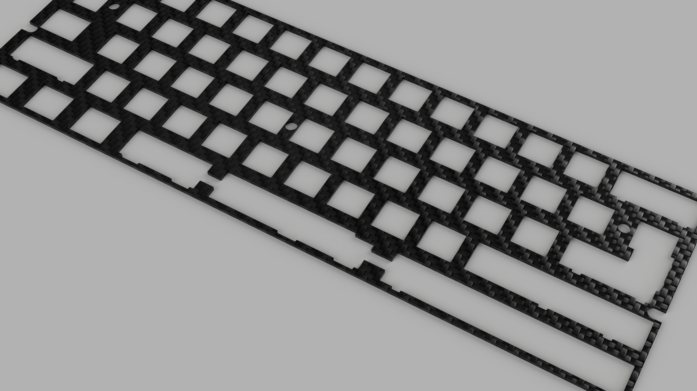
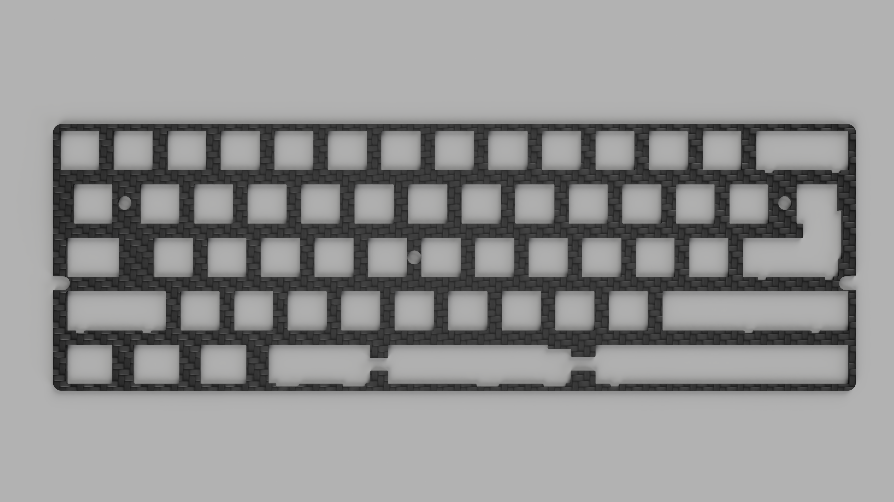
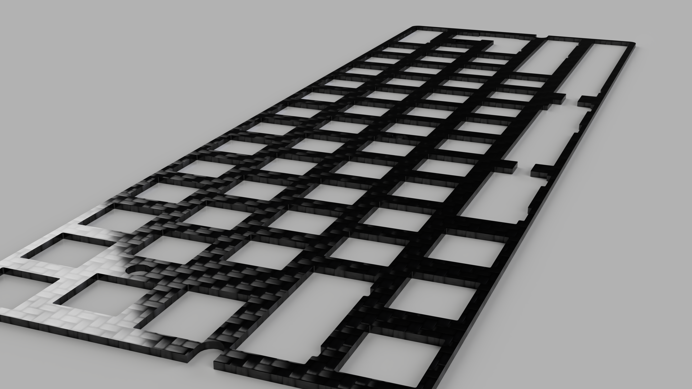
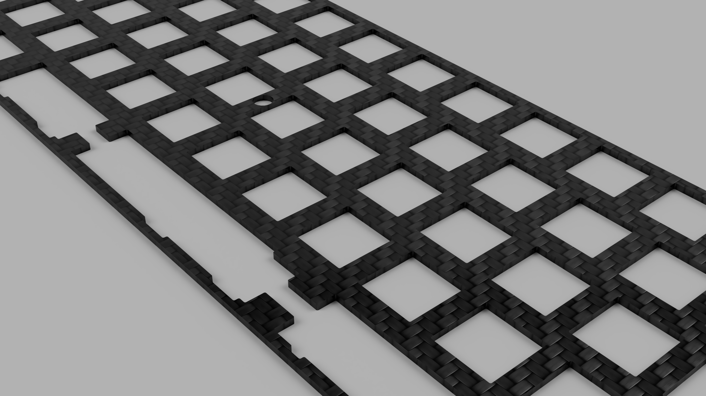
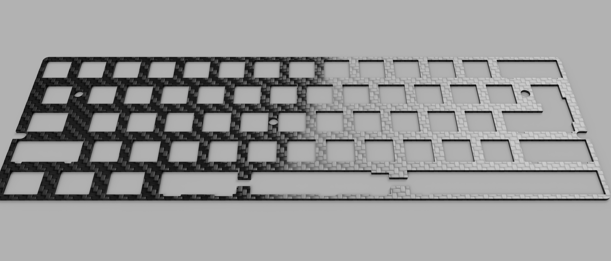
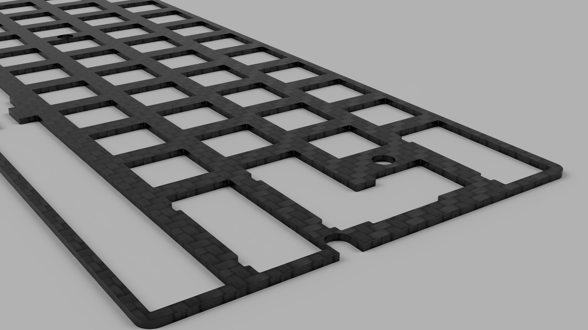

# Universal 60% Carbon Fiber Plates

This repository contains the CAD files for the universal 60% plates developed by FJLabs. These are designed to be cut with 1.5mm carbon fiber (though other plate materials also work), with at least a 0.1mm or better tolerance.

If you are interested in the current group-buy, please fill out the [Updated Interest Check](https://forms.gle/fkqsdYo3uiCMT57T8)!

## Table of Contents

- [Layouts](#Layouts)
- [Compatibility](#Compatibility)
- [Renders](#renders)
- [Plate Specifications](#plate-specifications)
- [About this Repository](#this-repository)

## Layouts

There are two types of plates included: those with support for a **2.25U Left Shift** (common 60%) and a **2U Left Shift** (specialized). The layouts supported are below:

### 2.25U Left Shift

### 2U Left Shift

Note that keys of the same color can be swapped betweeen the layout options and are represented similarly to other layout maps.

## Compatibility

### Stabilizer Compatibility

These plates are **known** to work with Cherry PCB Mount stabilizers. Corstar stabilizers are ***not*** compatible in any way without modification. Plate mount stabliizer compatibility is currently untested, but there is a high likelihood they will be compatible. Unfortunately, I do not have any plate-mount stabilizers available to test compatibility at this time.

### Case Compatibility

These plates are designed to be a drop-in replacement for the current KBDFans Aluminum and Brass plates. Therefore, these are known to comply with the universal 60% dimensions, at 285.5mm long and 94.5mm tall. These are known to fit the KBDFans 5-Degree and KBDFans Tofu cases, and will also fit any other case with similar dimensions. 

Case compatibility can not be guaranteed as this depends on the exact case in question, but the plate design mimics common 60% plates. These do **not** fit custom cases with unique requirements such as the Anne Pro 2 (with different mounting hole positions) or unique cases with bespoke plates.

### Switch Compatibility

These plates are compatible with standard Cherry MX switches *only*. These are not compatible with Alps, Choc, etc... but are compatible with any Cherry equivalent switches (Gateron, Kailh, Zealios, Holy Panda, etc...). 

## Renders

These renders were generated by Fusion 360 using the built-in "Carbon Fiber - Twill" texture and may not look exactly like the final material.

### 2.25U Left Shift

### 2U Left Shfit

## Plate Specifications

Plates were originally generated thanks to [SwillKB Plate Builder](http://builder.swillkb.com/). The KLE layout was condensed (unexploded) from the exact views shown above, and were input to Swill. Plate radius was set to 3mm to provide some nice rounded edge corners.

After generating the CAD files, minor modifications were made to prevent microscopic spaces present due to the overlapping layout. This included the bottom row, as well as the ANSI/ISO enter key. A fillet of 0.3mm was added to all corners to smooth the sharp edges a little bit. A bit of cleanup was done to prevent some jagged edges and make it easier to manufacture. 

## This Repository

The CAD files can be found in the *cad_files* folder and previous versions will be in past commits. 

The CAD files are offered under MIT License which allows for commercial use without disclosing the source. This was provided for general interest, to help broaden the keyboard market and make it as accessible as possible. Feel free to use these source files to create other group buys, including different materials and what have you. Roam free, have fun, but most importantly, *be kind*.